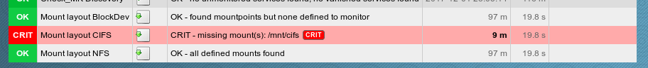

# check_mk-mounts_layout
A Check_MK plugin for checking for the presence of defined mountpoints

The check basically parses the mounts, nfsmounts and cifsmounts section of the standard check_mk_agent.
It compares the found mountpoints against defined mountpoints (thresholds). If a defined threshold is missing
in a the agent output an alert is thrown.

License: [GPLv2](LICENSE)  


## WATO integration
* define mountpoints to be checked for presence




## Alerting
* the check will stay okay if:
  * mountpoints are found, but no rule is defined
  * all defined mountpoints are presend
* an alerts will be thrown if a mount point is defined in a wato rule but not present


# Contributing
1. Create a personal fork of the project on Github.
2. Clone the fork on your local machine. Your remote repo on Github is called ```origin```.
3. Add the original repository as a remote called ```upstream```.
4. If you created your fork a while ago be sure to pull upstream changes into your local repository.
5. Create a new branch to work on!
6. Implement/fix your feature, comment your code.
7. Add or change the documentation as needed.
8. Push your branch to your fork on Github, the remote ```origin```.
9. From your fork create a pull request to the ```master``` branch.
