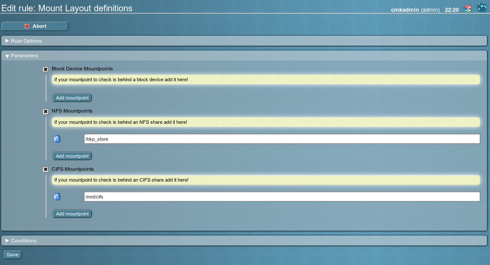

# check_mk-mounts_layout
A Check_MK plugin for checking for the presence of defined mountpoints

The check basically parses the mounts, nfsmounts and cifsmounts section of the standard check_mk_agent.
It compares the found mountpoints against defined mountpoints (thresholds). If a defined threshold is missing
in a the agent output an alert is thrown.

License: GPLv2  https://www.gnu.org/licenses/gpl-2.0.html

## WATO integration
* define mountpoints to be checked for presence

## Alerting
* the check will stay okay if:
  * mountpoints are found, but no rule is defined
  * all defined mountpoints are presend
* an alerts will be thrown if a mount point is defined in a wato rule but not present

